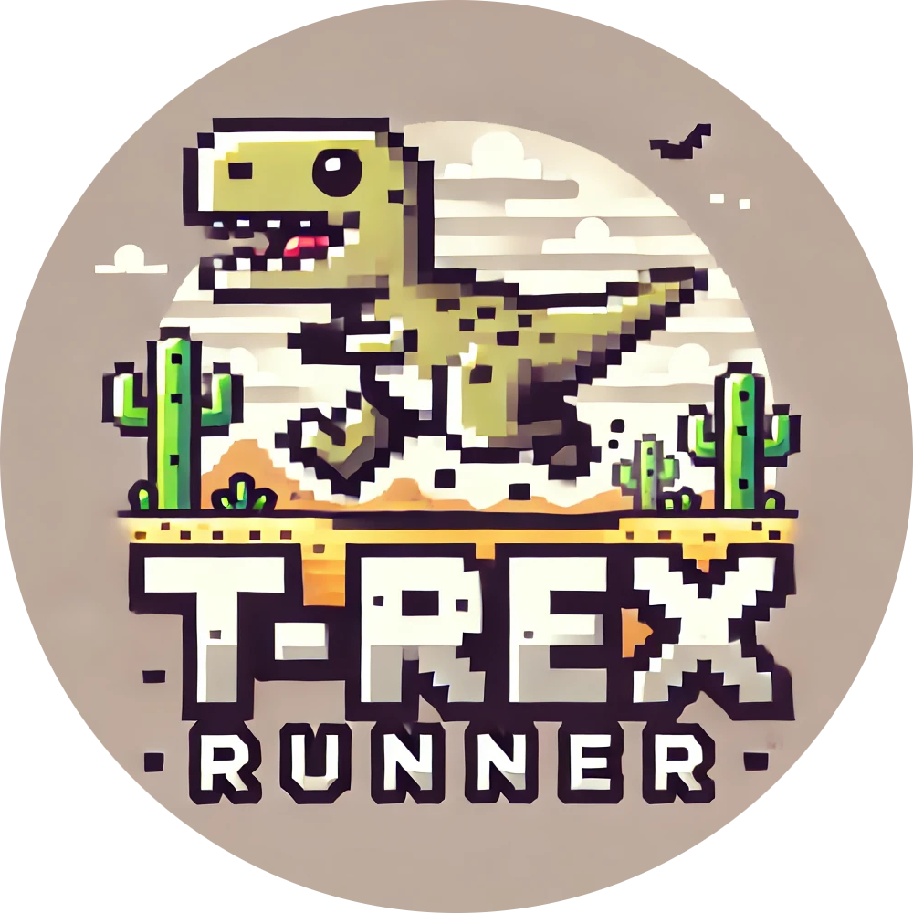
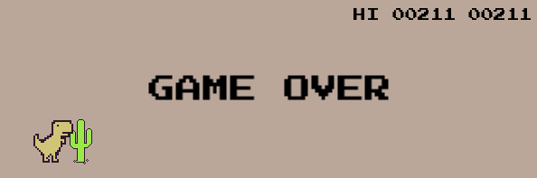

  

  

    A remake of the classic <strong>T-Rex Runner</strong> game!  
    Jump and avoid obstacles in this endless runner inspired by the famous Chrome browser offline game.  
    Built with performance and flexibility in mind using C++ and SFML.
  

  
<strong>Note:</strong> This is not a fully finished game. The main mechanics have been implemented, but there is still room for further development.

  
  
  
  

  

---

## Planned Improvements

Below is a list of features and improvements planned for future updates:

- **Obstacle Updates:** Add more variety to obstacles by introducing new textures and enhancing the logic for obstacle placement on the map.  
- **Graphics Enhancements:** Add textures for clouds, ground, and other game elements, along with logic for rendering them dynamically.  
- **Sound Effects:** Implement sound effects for actions like jumping, collisions, and game over.  
- **Difficulty Scaling:** Gradually increase the speed and complexity of obstacles as the player progresses.  
- **Game Over Screen:** Redesign the game over screen with a restart button.  
- **Game Start Animation:** Create an animation that plays when the game starts.  
- **Color Customization:** Add configurable color schemes to the game, and update text colors.  
- **Character Physics Tweaks:** Add configurable options for adjusting the character’s running speed, jump height, and falling speed.  
- **Crouching Mechanic:** Implement a crouching mechanic, allowing the character to duck and run under obstacles.  

Feel free to suggest additional features or contribute to the development!
